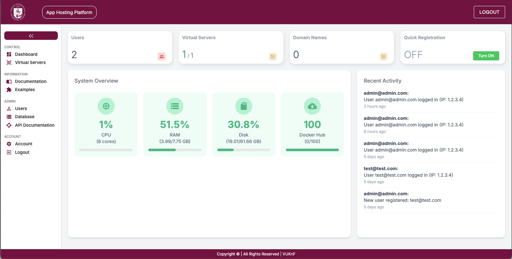
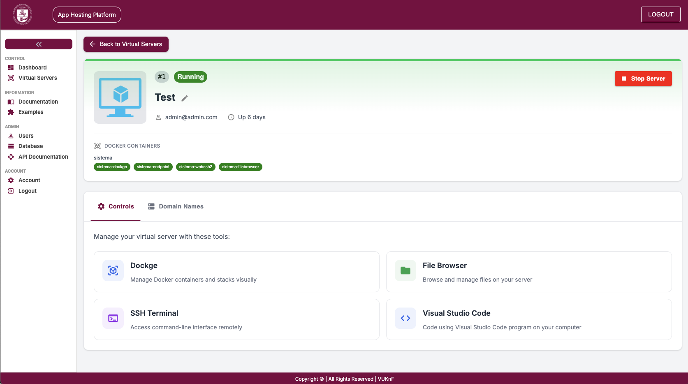
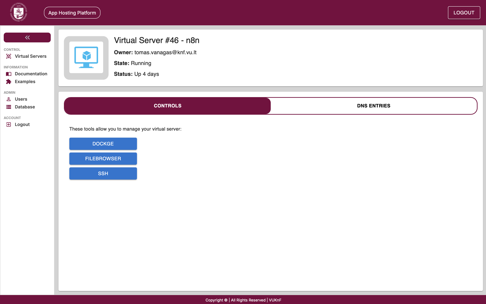

# Shared Hosting Platform
This repository contains the setup and deployment of shared hosting platform which gives users disposable linux environments. In these linux environments users can run and install apps and/or run docker containers. This is made possible by using Sysbox docker runtime with which users get to control docker container in which they can run inner docker containers (Docker-In-Docker).

 

## Security
- ***Unprivileged Containers:*** Using Sysbox docker runtime there is no need to compromise security while running Docker-In-Docker. Sysbox runtime allows unprivileged docker containers run docker inside them.
- ***Secured Local Subnets:*** Outgoing network traffic is filtered and does not allow access to local networks
  
 

## Screenshots

 

### Main screen showing running virtual servers (outer user docker containers):

 

### User virtual server control panel:

 

### Command line interface via WEB browser using WebSSH2:

 

## Overall Structure
Virtualization structure is as follows:

 

## Installation
Follow instructions here: [Installation Guide](https://github.com/kaunofakultetas/shared-hosting/blob/main/INSTALLATION.md) 
